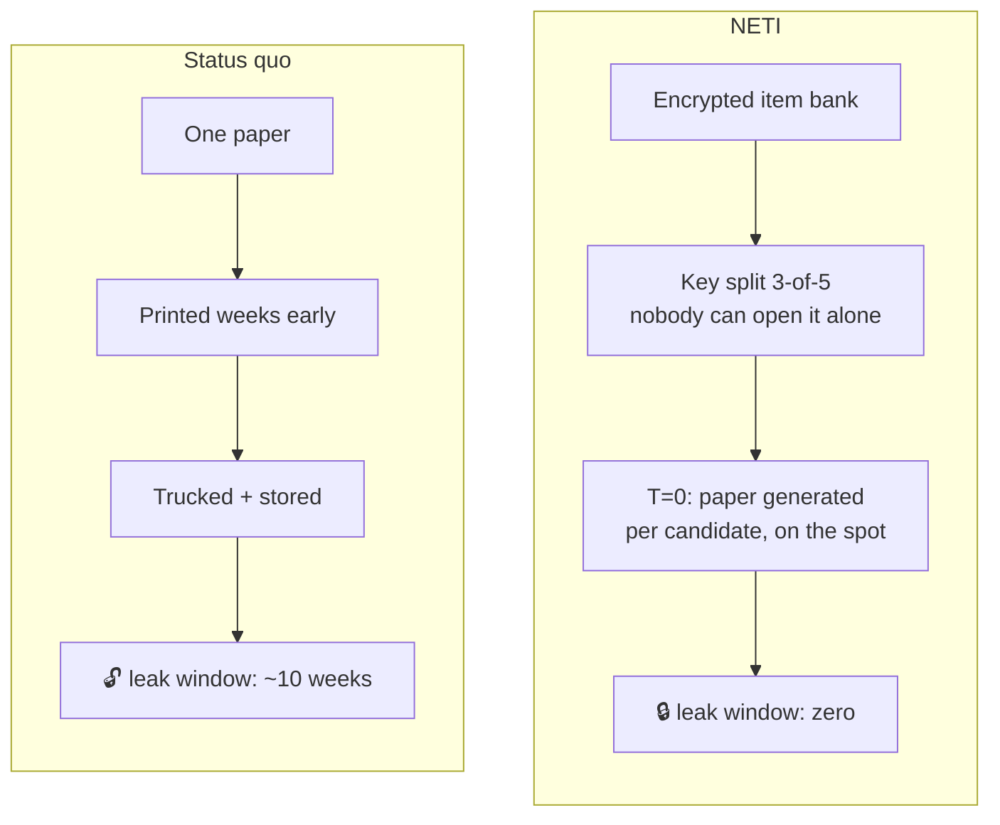
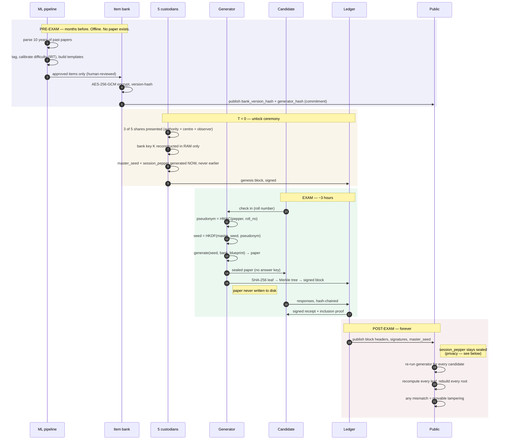
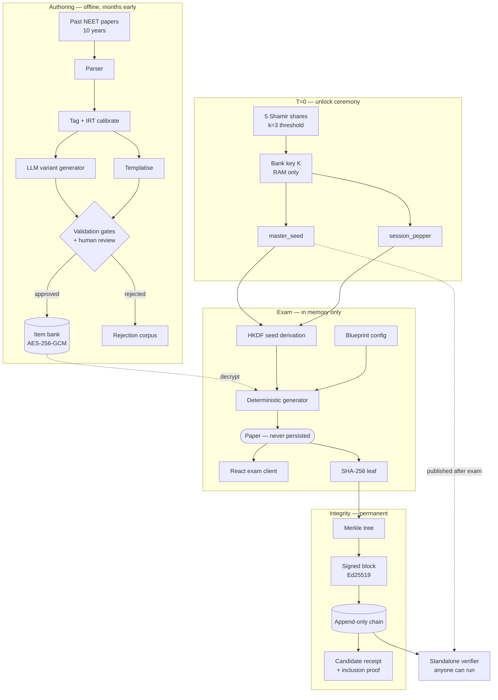
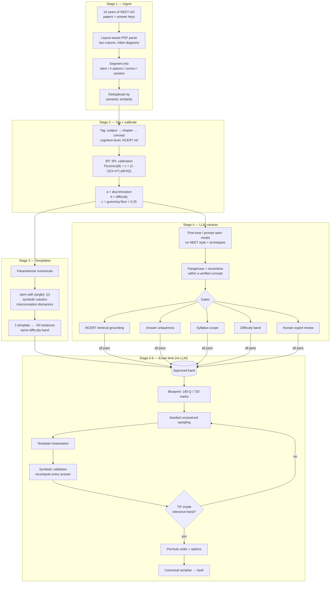
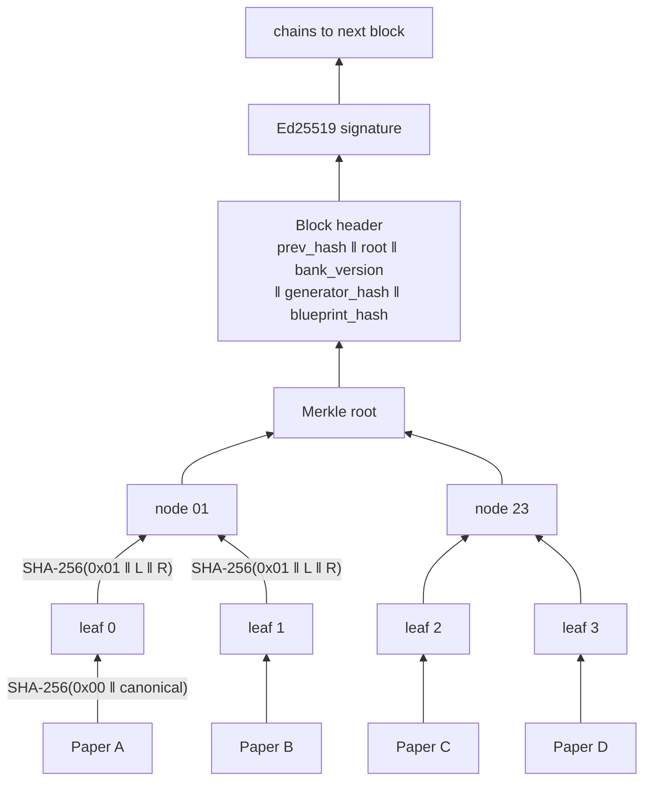

# NETI — Non-Exploitable Test Integrity

> A question paper that cannot leak, because it does not exist until the exam starts.

**Status:** working skeleton. Every layer is connected end to end and runs. Most layers are deliberately thin — see [What is actually built](#what-is-actually-built) before believing any claim below.

---

## Contents

1. [The problem](#the-problem)
2. [The idea in one picture](#the-idea-in-one-picture)
3. [Complete workflow](#complete-workflow)
4. [Architecture](#architecture)
5. [How the AI model works](#how-the-ai-model-works)
6. [How the integrity layer works](#how-the-integrity-layer-works)
7. [What is actually built](#what-is-actually-built)
8. [Run it](#run-it)
9. [Repository map](#repository-map)
10. [For AI coding agents](#for-ai-coding-agents)

---

## The problem

The 2024 NEET-UG leak compromised an exam sat by 2.4 million students. The failure was not cryptographic. It was physical.

One paper is authored months in advance, printed, boxed, trucked to thousands of centres, and stored in bank vaults until exam day. Every one of those steps is a human being with physical access to the answer key. Investigations traced the leak to exactly those seams — transit and storage, days before the exam.

```
Author ──── Print ──── Transport ──── Vault ──── Exam day
   └─────────────── ~10 weeks of exposure ──────────┘
        a physical object with the answers exists
        and hundreds of people can touch it
```

You cannot encrypt your way out of a printed page in a van.

## The idea in one picture

NETI deletes the thing being guarded.



Three properties, in order of importance:

| # | Property | Why it matters |
|---|---|---|
| 1 | **Nothing exists to leak before T=0** | No printed paper, no decryptable bank, no single custodian with the key |
| 2 | **Every candidate gets a different paper** | Stealing one is worthless — it predicts nothing about anyone else's |
| 3 | **Everything is provable afterwards** | Anyone can re-run the generator and prove nobody was slipped an easier paper |

Property 3 is the "bitcoin-grade" part. Not a cryptocurrency — the thing that actually made Bitcoin work: an append-only, hash-linked, publicly verifiable record that no insider can rewrite.

## Complete workflow

The full lifecycle, from authoring a question to auditing the exam years later.



**The key insight in step 21–23:** publishing `master_seed` is what makes the exam auditable. Anyone can regenerate all 2.4 million papers and check them against the ledger. A substituted or softened paper produces a leaf that does not match.

## Architecture



### Components

| # | Component | Code | Does |
|---|---|---|---|
| 1 | **Item bank** | `backend/app/bank/` | Encrypted, versioned, IRT-calibrated question store |
| 2 | **Key release** | `backend/app/core/` | Shamir 3-of-5 custodian ceremony |
| 3 | **Seed service** | [`exam/seeds.py`](backend/app/exam/seeds.py) | Peppered pseudonym → HKDF per-candidate seed |
| 4 | **Generator** | [`generation/`](backend/app/generation/) | Pure deterministic function, no I/O, no clock, no LLM |
| 5 | **Ledger** | [`ledger/`](backend/app/ledger/) | Canonical hashing, Merkle tree, chained signed blocks |
| 6 | **Exam delivery** | [`app/main.py`](backend/app/main.py) | Session lifecycle, response chain, receipts |
| 7 | **Frontend** | [`frontend/src/`](frontend/src/) | Exam client + (planned) invigilator console |
| 8 | **Verifier** | `scripts/` | Standalone re-derivation and audit tool |

Detail: [docs/ARCHITECTURE.md](docs/ARCHITECTURE.md).

## How the AI model works

> **Honest status: no model has been trained yet.** The pipeline below is the design. Stages 1–3 are specified and partially scaffolded; stage 4 (the LLM) is designed but unimplemented. The generator currently runs on 12 hand-written placeholder items. Full spec: [docs/AI_PIPELINE.md](docs/AI_PIPELINE.md).

### The constraint that shapes everything

A generated question that is wrong, ambiguous, or unanswerable is worse than no system at all. So **the model never has final say.** The LLM proposes; a symbolic validator and a human expert dispose.

Second constraint: 2.4 million *different* papers must be *equally hard*. Uniqueness without equating is just a new kind of unfairness — and a lawsuit.

### Training and generation pipeline



### What "trained on past papers" actually means

Four separable things are learned from the corpus — only the fourth is a neural model:

| # | What is learned | How | Neural? |
|---|---|---|---|
| 1 | **Blueprint** — chapter weightage, cognitive mix | Statistical measurement over the corpus | No |
| 2 | **Templates** — reusable question patterns | Human + assisted extraction of parameterised forms | No |
| 3 | **Distractors** — real student misconceptions | Mined from the wrong options examiners chose | No |
| 4 | **Variant generator** — NEET style and archetypes | Fine-tuned or prompted open model (Llama / Mistral class) | **Yes** |

Most of the generation *volume* comes from #2, not #4. One projectile template with 6 angles × 9 speeds yields 54 instances whose reasoning is identical and whose difficulty is therefore near-identical. That is what makes millions of genuinely equivalent papers possible.

### Why the LLM never runs at exam time

It runs **offline, during authoring**, and its output is frozen into the approved bank before the exam. At exam time, generation is deterministic template instantiation.

An LLM call during the exam would make `generate(seed, bank, blueprint)` non-reproducible, which would destroy the audit guarantee entirely. This is a hard invariant, not a preference.

### Known gaps in the ML plan

- **No response data.** Past papers give questions but not *how many students got each one wrong*. IRT calibration needs that. Fallback: expert priors, then a pilot administration. This is the first thing an examiner will poke at.
- **Biology does not templatise.** Conceptual items rely on bank breadth and stage 4.
- **Diagram generation is unsolved.** Current plan is a curated diagram library with parameterised labels.
- **Bilingual parity.** Machine translation is not acceptable for a high-stakes exam; needs bilingual authoring.

## How the integrity layer works



Four details that are load-bearing:

1. **Domain separation.** Leaves are tagged `0x00`, internal nodes `0x01`. A value valid in one position can never be replayed in another.
2. **Odd nodes are promoted, not duplicated.** Duplicating the last node lets two different leaf sets produce the same root — the CVE-2012-2459 forgery. See `test_odd_node_is_promoted_not_duplicated`.
3. **The block header commits the generator source hash.** A doctored build produces papers that fail verification.
4. **Insertion order is part of the record.** Leaves are never sorted.

### Privacy — why a pepper exists

Roll numbers are sequential and enumerable. If the seed derived from `candidate_id` directly, publishing `master_seed` for audit would let anyone regenerate any named candidate's exact paper.

```
pseudonym = HMAC-SHA256(session_pepper, candidate_id)   ← pepper NEVER published
seed      = HKDF-SHA256(master_seed, salt=session_id, info=pseudonym)
```

| Party | Holds | Can do |
|---|---|---|
| Public | `master_seed`, ledger | Verify every paper. **Cannot link a paper to a person.** |
| Candidate | Their signed receipt | Prove which paper *they* sat. Learns nothing about others. |
| Auditor / court | `session_pepper` under warrant | De-anonymise when legally compelled |

This also resolves the DPDP Act 2023 conflict: an append-only ledger cannot honour erasure, so only pseudonyms and hashes go on it. Delete the identity mapping and ledger rows become permanently anonymous.

Full spec: [docs/INTEGRITY.md](docs/INTEGRITY.md).

## What is actually built

Be precise about this — overclaiming is the fastest way to discredit the work.

| Layer | Status | Detail |
|---|---|---|
| Canonical hashing + domain separation | ✅ **Real** | RFC 8785-approximate, floats rejected |
| Merkle tree + inclusion proofs | ✅ **Real** | Node promotion, 26 passing tests |
| Seed derivation + pepper | ✅ **Real** | HMAC pseudonym + HKDF |
| Deterministic RNG | ✅ **Real** | Counter-based SHA-256, rejection sampling |
| Blueprint config | ✅ **Real** | `NEET_UG` + small `DEMO` |
| Paper generation | 🟡 **Skeleton** | Samples + instantiates. **No IRT targeting, no exposure caps** |
| Item bank | 🟡 **Placeholder** | 12 hand-written items, unencrypted JSON |
| FastAPI service | 🟡 **Skeleton** | In-memory, single session, resets on reload |
| Exam client | 🟡 **Skeleton** | Works; no timer, no autosave, no kiosk mode |
| Block signing + chaining | ❌ **Not built** | Leaves accumulate, no block is ever sealed |
| Shamir key ceremony | ❌ **Not built** | Stubbed by `POST /session/open` |
| Response submission | ❌ **Not built** | Submit fetches a receipt; answers are not sent |
| ML pipeline | ❌ **Not built** | Designed only. No model trained. |
| Standalone verifier | ❌ **Not built** | Specified in INTEGRITY.md §11 |
| Postgres + append-only grants | ❌ **Not built** | Everything is in memory |

Roadmap and cut lines: [docs/ROADMAP.md](docs/ROADMAP.md).

## Run it

```bash
# terminal 1 — backend
cd backend
pip install -r requirements.txt
pytest                              # 26 tests must pass
uvicorn app.main:app --reload       # http://localhost:8000/docs

# terminal 2 — frontend
cd frontend
npm install
npm run dev                         # http://localhost:5173
```

Check in with any roll number. You get a paper generated on the spot and, on submit, a receipt with a Merkle inclusion proof. A different roll number gives a different paper; the same roll number gives a byte-identical one. That reproducibility is the whole audit guarantee.

Per-role first tasks: [GETTING_STARTED.md](GETTING_STARTED.md).

## Repository map

```
AGENTS.md              ← canonical context. Read first.
CLAUDE.md              ← pointer for Claude Code
GETTING_STARTED.md     ← run it + per-role first task
.cursor/rules/         ← pointer for Cursor
.github/               ← pointer for Copilot

backend/
  app/
    ledger/            ✅ canonical.py, merkle.py      — integrity core
    exam/              ✅ seeds.py                     — pseudonym + HKDF
    generation/        🟡 rng.py, blueprint.py, generator.py
    bank/              🟡 sample_bank.json             — 12 placeholder items
    core/              ❌ key ceremony
    main.py            🟡 FastAPI, in-memory
  tests/               ✅ 26 passing — ledger + determinism

frontend/src/
  api.ts               ← the backend↔frontend contract. Typed.
  App.tsx              check-in → exam → receipt
  components/          ExamClient, ReceiptCard

docs/                  ARCHITECTURE, INTEGRITY, AI_PIPELINE,
                       THREAT_MODEL, TEAM, ROADMAP
ml/                    ❌ not created yet
scripts/               ❌ verifier not created yet
```

## For AI coding agents

Context loads automatically from [AGENTS.md](AGENTS.md) (Cursor, Codex, Copilot), [CLAUDE.md](CLAUDE.md) (Claude Code), or [.cursor/rules/neti.mdc](.cursor/rules/neti.mdc).

Every gap in the code is marked `TODO(role N)` matching [docs/TEAM.md](docs/TEAM.md). Search for them.

**Changes that will be rejected regardless of how well they work:**

- Persisting an assembled paper anywhere
- Anything non-deterministic in `generation/` — caching, memoization, parallelism, retries, `random`, timestamps
- `UPDATE` or `DELETE` against a ledger table
- Inventing crypto instead of using the primitives in [docs/INTEGRITY.md](docs/INTEGRITY.md)
- Weakening a security property to make a test pass
- Putting personally identifying data on the ledger
- Changing behaviour without updating the doc that specifies it

## Documentation

| Doc | Read it when |
|---|---|
| [AGENTS.md](AGENTS.md) | First. Context and hard invariants. |
| [GETTING_STARTED.md](GETTING_STARTED.md) | You want to run it and find your first task |
| [docs/ARCHITECTURE.md](docs/ARCHITECTURE.md) | You need components and data flow |
| [docs/INTEGRITY.md](docs/INTEGRITY.md) | Hashing, Merkle, signing, key release |
| [docs/AI_PIPELINE.md](docs/AI_PIPELINE.md) | Question generation or equating |
| [docs/THREAT_MODEL.md](docs/THREAT_MODEL.md) | Proposing or challenging a security change |
| [docs/TEAM.md](docs/TEAM.md) | Who owns what |
| [docs/ROADMAP.md](docs/ROADMAP.md) | What's real vs. planned |

## Team

Five people. Owner: Vivek ([@kevivek-cyber](https://github.com/kevivek-cyber)) — tech lead, integrity layer. Roles: [docs/TEAM.md](docs/TEAM.md).

## Scope

Academic capstone. This demonstrates a *mechanism*; it is not certified for, endorsed by, or deployed on any live examination. Statements about the 2024 NEET leak refer to publicly reported facts — the design response is ours.

## License

TBD — see [docs/TEAM.md](docs/TEAM.md) § Governance. The verifier must end up open source; the accountability argument collapses if the public cannot run it.
